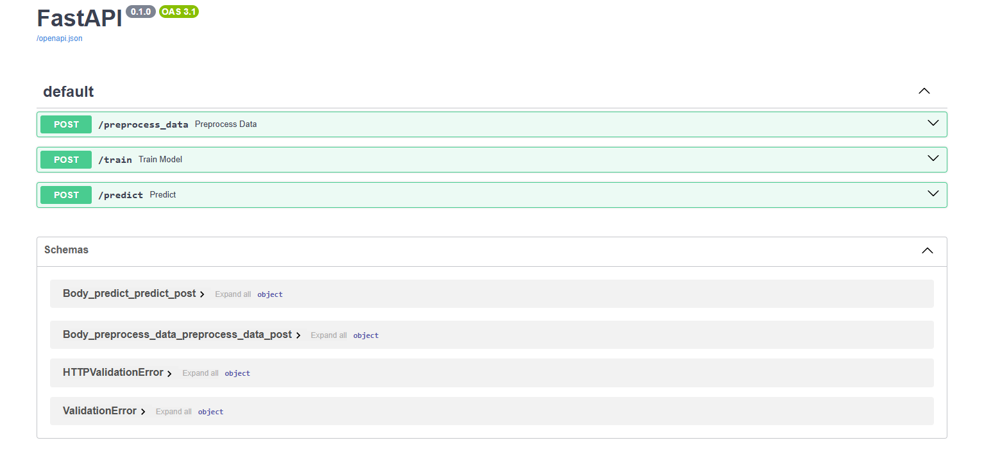
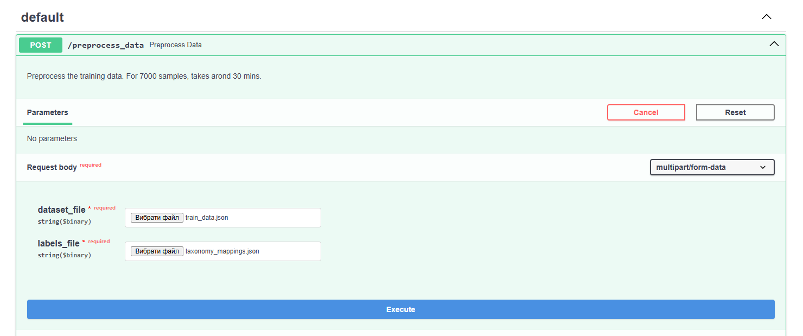
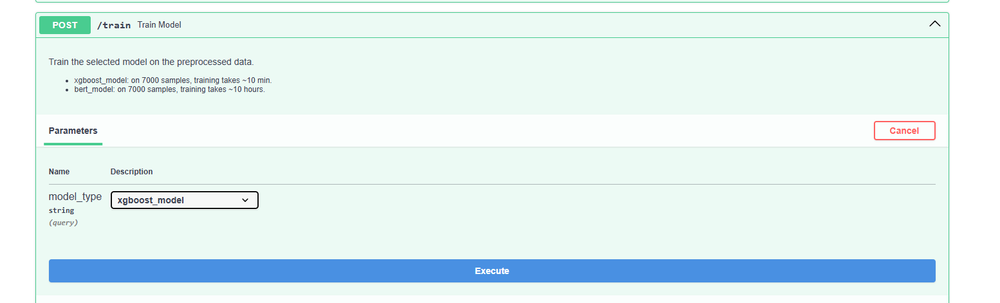

# News Article Classification

This project outlines a comparison of different approaches for classifying the news articles. It covers an EDA, data preprocessing, approaches used and the evaluation metrics for each approach, API and dockerization.

## Summary

The task involves multi-label text classification, where each article can belong to multiple categories with associated confidence scores. Given a dataset containing article titles, full text, and labeled categories with probabilities, the goal is to train a model that predicts a list of relevant labels along with confidence scores for unseen articles.

## Evalation

### Metrics

1. **Accuracy**
    - Measures the proportion of samples where all predicted labels exactly match the true labels.
    - Very strict in multilabel settings: one wrong label makes the entire sample incorrect.

2. **Precision**
    - The ratio of correctly predicted labels to all labels predicted as positive.
    - High precision means few false positives.
    - Macro-averaged, treating each label equally.

3. **F1-score (Macro)**
    - Harmonic mean of precision and recall, averaged across all labels.
    - Macro F1 gives equal weight to rare and frequent labels.
    - Good for evaluating overall label-wise performance in imbalanced datasets.

4. **Hamming Loss**
    - Fraction of incorrectly predicted labels (false positives + false negatives) over all labels.
    - Lower is better.
    - Unlike accuracy, it penalizes each label independently, giving a more forgiving view of performance.

5. **Jaccard Score**
    - Also known as Intersection over Union (IoU).
    - Measures the overlap between predicted and true label sets.
    - More informative than accuracy for multilabel tasks with partial matches.

### Results

`BERT` model, trained on summaries, performed on par with `XGBoost` with `TF-IDF`, but suffered from long training and inference times.
In comparison, `XGBoost` with `TF-IDF` vectorization performed much faster, with sligtly lower F1-score.

| Model                    | Training time (min) | Accuracy   | Precision  | F1-score (macro) | Hamming Loss | Jaccard Score |
| ------------------------ | ------------------- | ---------- | ---------- | ---------------- | ------------ | ------------- |
| XGBoost (`TF-IDF`)     | `10`              | `0.4993` | `0.8998` | 0.7116           | `0.0378`   | `0.6540`    |
| BERT (`summary`)       | 600                 | 0.4902     | 0.8531     | `0.7530`       | 0.0396       | 0.6493        |
| BERT (`title`)         | 40                  | 0.4070     | 0.7330     | 0.6451           | 0.0421       | 0.6050        |
| BERT (`text`)          | 720                 | 0.4486     | 0.8047     | 0.7272           | 0.0447       | 0.6296        |
| BART (`zero-shot`)     | -                   | 0.0        | 0.0849     | 0.1415           | 0.1000       | 0.1210        |
| XGBoost (`embeddings`) | 200                 | 0.3901     | 0.6714     | 0.5631           | 0.0450       | 0.5503        |

## API

To enable testing and deployment, the entire workflow, including data preprocessing, model training, and inference was integrated into a `FastAPI` application (`api.py`). This allows for quick interaction with the model via API endpoints.

Using integrated `Swagger UI` makes it even more convenient. Accessible on `http://localhost:5000/docs`.

---

`/preprocess_data`

---

`/train`

---

`/predict`

## Docker

`Dockerfile` and `.dockerignore` were created to wrap the API in a container, for deployment or testing.

The requirements are outlined in `requirements.txt`

---

**Build image**

`docker build -f Dockerfile -t text-classification .`

**Run Container**

`docker run -p 5000:5000 text-classification`